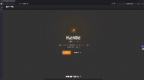
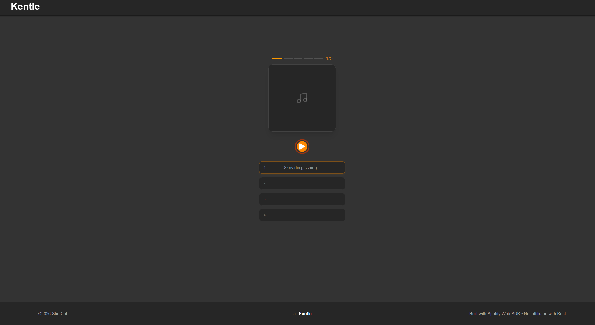
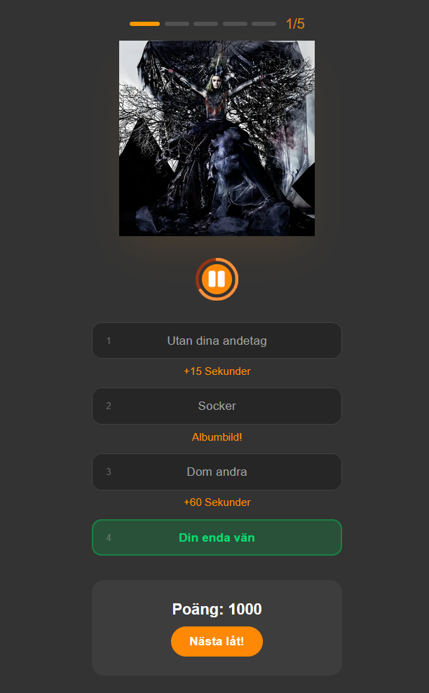
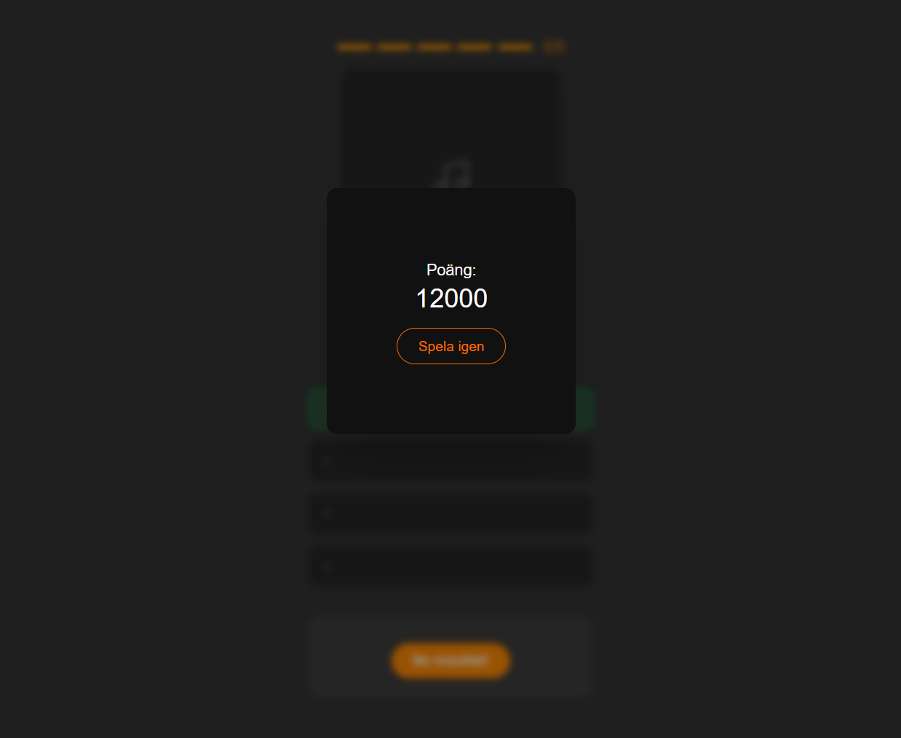

# Kentle
A music quiz app with Kent theme, music playback and song fetching handled with Spotift Web SDK.
Available at: [kentle.shotcrib.com](https://kentle.shotcrib.com)
--------------------------------------------------------------------
## Demo


## Screenshots
| Start | End | Results |
|------|-------|---------|
|  |  |  |

## Overview
Connect to your Spotify (premium) account. Then you can play a music quiz where, for each guess, it gets little bit easier, but you recive less points. Play 5 rounds and try to get a perfect score of 10 000 points!

## Tech Stack


## Data


## Setup
### Prerequisites
- Docker

### Installation
```bash
git clone https://github.com/ShotCrib77/kentle-2026 kentle
cd kentle
cp .env.build.example .env.build
cp .env.runtime.example .env.runtime
docker build -t kentle .
docker run -d -p 4001:3000 --env-file .env.runtime --name kentle kentle
```
Don't forget to fill in the .env files! See .env.build.example and .env.runtime.example for reference.

## Notes
Currently, this project has some serious limitations. Spotify unfortunetly dosen’t allow public apps like these to be shared, and the app can therefore only be used by accounts explicitly whitelisted in the Kentle dashboard, and the limit for whitelisted accounts is 5 accounts. Sadly theres no real way to get around this since Spotify explicitly states that they won’t accept small hobiyst apps and will only support larger projects and companies that they directly collaborate with, to use their API more for public use.

Previosuly I have made other versions of this app, first in raw HTML and then later on with vanilla React. Neither of these were good enough to actually ship, but now I have finally made a version that is functioning. The main challenge was keeping game logic and the Spotify Web SDK Player from bleeding into each other, to solve this, I ended up splitting their logic into two separate custom hooks.
## License
[MIT](./LICENSE)
